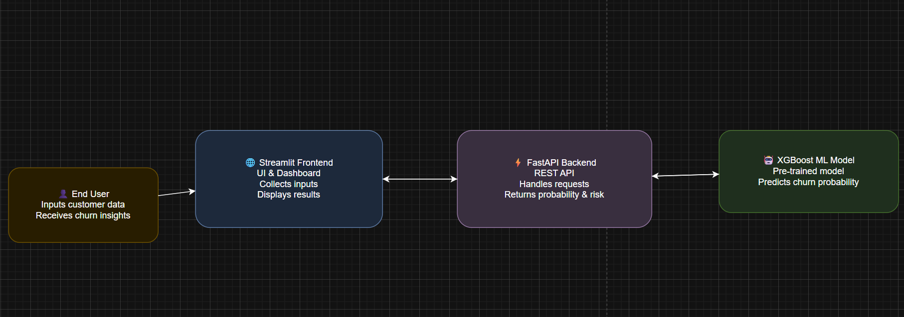

## 📊 Customer Churn Prediction & Retention Strategy System

An end-to-end **data science and business intelligence project** that predicts customer churn, quantifies revenue at risk, simulates retention strategies, and presents actionable insights through an interactive Power BI dashboard and a production-ready API.

---

## 🚀 Project Overview

Customer churn is a major challenge for subscription-based businesses.  
This project goes beyond churn prediction by answering **three key business questions**:

1. **Which customers are likely to churn?**
2. **How much revenue is at risk due to churn?**
3. **Which retention strategy reduces churn the most?**

The solution integrates **machine learning, SQL, API development, and BI visualization** into a single decision-support system.

---

## 🧠 Key Features

- 🔍 **Churn Prediction**
  - Machine learning model predicts churn probability for each customer
  - Customers segmented into **Low, Medium, and High risk**

- 💰 **Revenue at Risk Analysis**
  - Estimates annual revenue at risk using predicted churn probabilities
  - Aggregated by risk segment for business prioritization

- 🧪 **Retention Strategy Simulation**
  - Simulated strategies:
    - Discount offers
    - Contract upgrades
    - Tech support addition
  - Compared strategies based on **average churn probability reduction**

- 🌐 **FastAPI Prediction Service**
  - REST API for real-time churn prediction and recommendations

- 📊 **Power BI Dashboard**
  - One-page executive dashboard showing:
    - Customer risk distribution
    - Revenue at risk by segment
    - Impact of retention strategies

---

## 🛠️ Tech Stack

- **Python** (pandas, scikit-learn, joblib)
- **Machine Learning** (classification models)
- **SQL / SQLite** (post-prediction analysis & storage)
- **FastAPI** (production-ready API)
- **Power BI** (business dashboard)
- **Git & GitHub** (version control)

---

